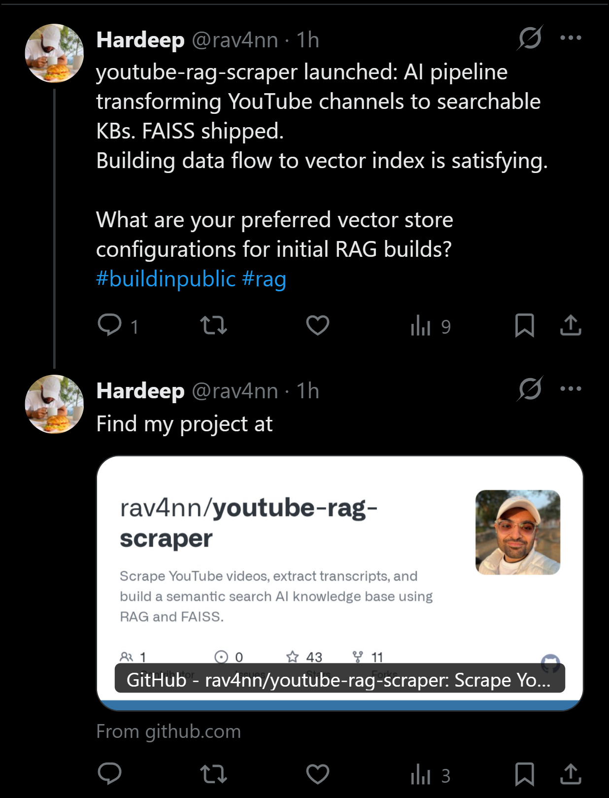
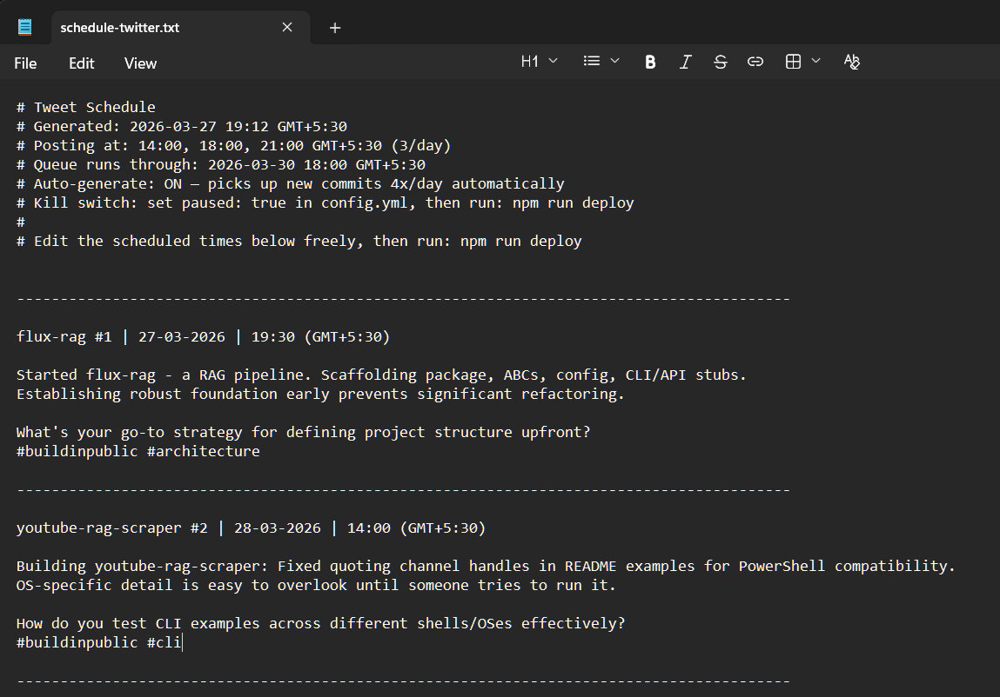

# buildinpublic-x

Summarize your github commits for the day/week to make actually good tweets using an LLM

github green squares → twitter/bluesky posts

---

## Why this exists

You want to build in public

but

* you don’t know what to post
* you forget to post
* writing tweets feels like extra work

Your commits already tell the story!
They just don’t sound like tweets

---

## What this does

* reads your commits over a day/week
* summarizes them with context from your readme 
* uses an LLM (you choose) to turn them into clear, relevant tweets
* lets you review and edit
* schedules and posts automatically
* for live projects - posts automatically every few hours

No backend. No database. No SaaS.
Everything runs from your repo.

---

## Example



---

## How it works

1. Fork this repo
2. Add your API keys (LLM + X or Bluesky) to your .env 
3. Generate posts from your commits + project README context
4. Review → approve → done

Your posts are now scheduled!

---

## Commands

```bash
# 1. Fork this repo on GitHub, then clone your fork
git clone https://github.com/your-username/buildinpublic-x && cd buildinpublic-x

# 2. Push your .env secrets to GitHub — run once after setup
npm run setup

# 3. Generate posts from your repo's recent commits
npm run generate -- my-repo --n=5

# 4. Review posts in my-repo/my-repo-tweets.txt, then run schedule command
npm run approve

# 5. Push the schedule live if all looks okay
npm run deploy
```

`npm run post` and `npm run auto-generate` run automatically via GitHub Actions — you don't need to call them manually.



---

## Auto mode

```yaml
auto_generate: true
```

New commits are picked up multiple times a day
posts get generated and scheduled automatically

---

## Platforms

### Bluesky — free, no approval needed

Go to Bluesky → Settings → Privacy and Security → App Passwords → Add App Password. Copy the generated password — that's your `BLUESKY_APP_PASSWORD`. Your identifier is your handle e.g. `yourname.bsky.social`.

This is the default platform in `config.yml`. Zero cost, works immediately.

### X (Twitter) — pay per use

Apply for a developer account at [developer.twitter.com](https://developer.twitter.com). Be specific in the use case form: *"Personal automation to post my GitHub commits to my X account. No scraping, no third-party data."*

Each post costs $0.02 (including the reply with your repo's github link). At 3 posts/day your initial $5 credit lasts almost 3 months.

To post to both platforms:

```yaml
platforms:
  - bluesky
  - x
```

---

## Who this is for

* indie hackers trying to stay consistent
* devs who commit regularly but don’t post
* anyone who has said “I should build in public” but hasn’t

---
