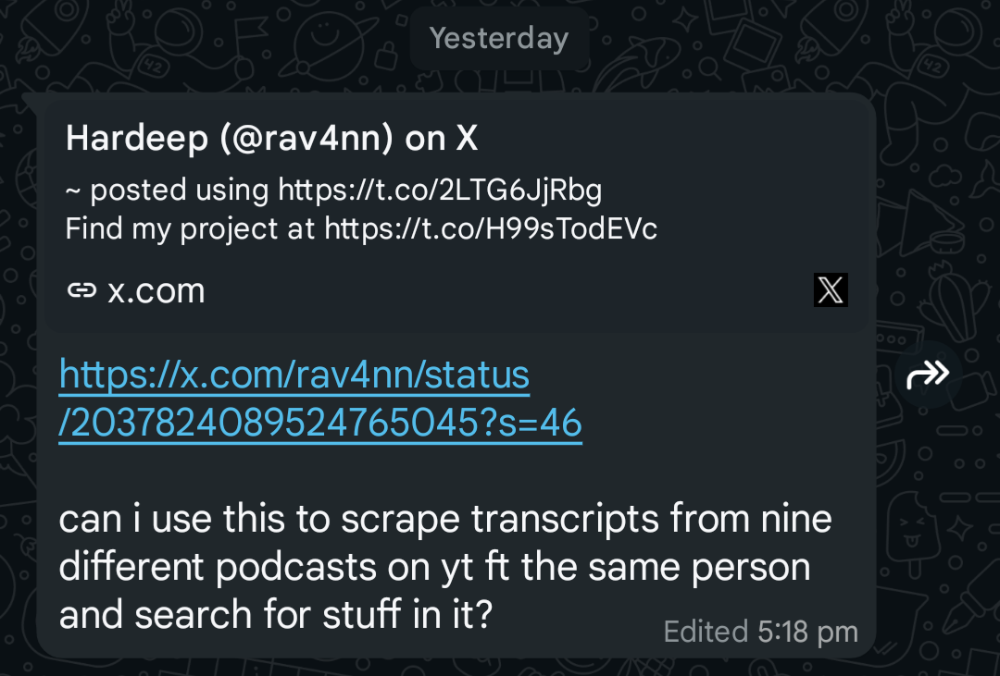
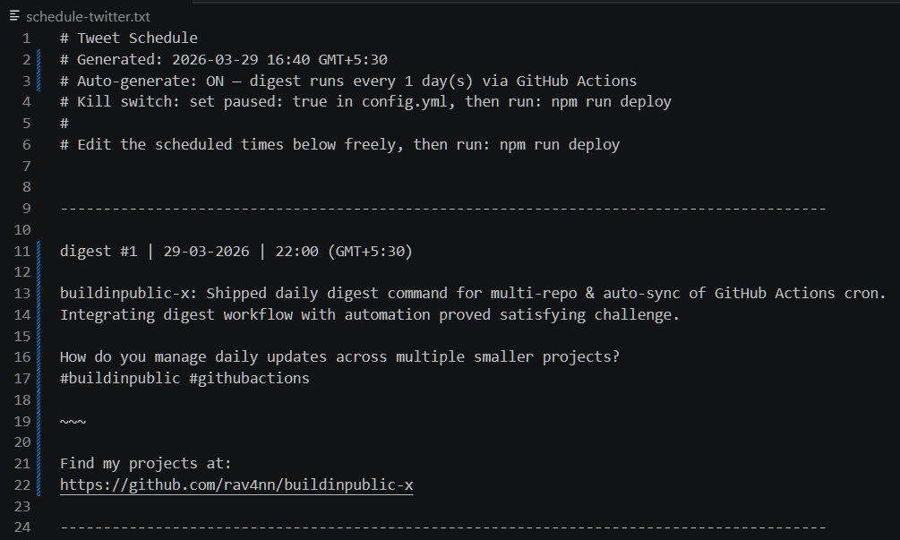

# buildinpublic-x

Turn your GitHub commits into a daily build-in-public thread - automatically.

daily github green squares → nightly twitter/bluesky post

---

## Why this exists

You want to build in public

but

* you don't know what to post
* you forget to post everyday
* writing tweets feels like extra work

Your commits for the day already tell the story!
They just don't sound like tweets

---

## What this does

* reads your commits across your chosen repos every day
* uses your project READMEs as context so tweets actually make sense
* runs an LLM (you choose) to write a clean, honest thread
* schedules and posts it automatically at your chosen time
* no backend, no database, no SaaS - everything lives in your repo

---

## Example


---

## What happens when you build in public

Within a day of auto-posting about my projects, I got this from an acquaintance —



---

## Daily digest — the main feature

Set `tracked_repos` in `config.yml` and the tool does the rest.

Every day (or however often you want), it:

1. Fetches commits from each of your tracked repos since the last post
2. Generates one tweet per repo summarizing the work
3. Assembles them into a thread — first repo as the main tweet, others as replies, attribution as the final reply
4. Schedules it for `digest_time` and posts automatically via GitHub Actions

```yaml
tracked_repos:
  - my-saas
  - my-cli-tool

digest_time: "21:00"   # when to post (your local timezone)
digest_days: 1         # post daily, look back 1 day of commits
```

Preview the thread before it posts:

```bash
npm run digest preview
```

---

## How it works

1. Fork this repo on GitHub
2. Add your API keys (LLM + X or Bluesky) as GitHub Secrets — `npm run setup` does this for you
3. Set `tracked_repos`, `digest_time`, and `digest_days` in `config.yml`
4. Run `npm run deploy` to push your config live
5. GitHub Actions handles everything from here — digest generates, schedules, and posts on its own

---

## Commands

```bash
# One-time setup: push .env keys to GitHub Secrets
npm run setup

# Schedule the digest (skips if one is already scheduled)
npm run digest

# Push your schedule and config changes to GitHub
# Posting happens automatically!
npm run deploy

# Check what's scheduled and when
npm run status

# Override the lookback window (e.g. last 3 days of commits)
npm run digest 3

# Replace the currently scheduled digest with a fresh one
npm run digest force

```



---

## Older projects — generate tweets on demand

For repos you're not actively committing to, use the manual flow:

```bash
# Generate tweet drafts from a repo's recent commits
# n=number of tweets to generate
npm run generate -- my-repo --n=5

# Review drafts in my-repo/my-repo-tweets.txt, then approve
npm run approve

# Push the schedule live
npm run deploy
```

---

## Platforms

### Bluesky — free, no approval needed

Go to Bluesky → Settings → Privacy and Security → App Passwords → Add App Password. Copy the generated password — that's your `BLUESKY_APP_PASSWORD`. Your identifier is your handle e.g. `yourname.bsky.social`.

This is the default platform in `config.yml`. Zero cost, works immediately.

### X (Twitter) — pay per use

Apply for a developer account at [developer.twitter.com](https://developer.twitter.com). Be specific in the use case form: *"Personal automation to post my GitHub commits to my X account. No scraping, no third-party data."*

Each post costs $0.02 (including the attribution reply). At 3 posts/day your initial $5 credit lasts almost 3 months.

To post to both platforms:

```yaml
platforms:
  - bluesky
  - x
```

---

## Who this is for

* indie hackers trying to stay consistent
* devs who commit regularly but don't post
* anyone who has said "I should build in public" but hasn't

---
